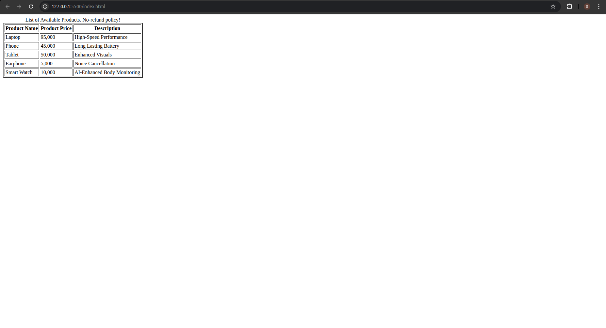

# Product Table
## Date: 07/07/2025
## Objective:

To create a structured HTML table that displays product-related information, including product names, prices, and descriptions, useful for catalogs, listings, or e-commerce prototypes.

## Tasks:

### 1. Set Up the Basic HTML Structure:

Use ```<!DOCTYPE html>```, ```<html>```, ```<head>```, and ```<body>``` tags to define the document layout.

Include a ```<title>``` such as "Product Table".

### 2. Create a Table Element:

Use the ```<table>``` tag to begin the product table.

### 3. Add a Table Header:

Use the ```<thead>``` section with a ```<tr>``` row and three ```<th>``` elements:

Product Name

Product Price

Description

### 4. Insert Table Body Rows:

Use the ```<tbody>``` section with multiple ```<tr>``` rows.

In each row, use three ```<td>``` cells for:

The name of the product (e.g., Laptop, Phone)

The price (e.g., ₹45,000, $499)

A short description (e.g., "High-speed performance", "Budget-friendly")

### 5. Ensure Semantic Structure:

Include ```<caption>``` if needed to describe the table purpose.

Use meaningful text inside the table for clarity.

### 6. No CSS or JavaScript:

Keep the table design strictly in HTML for simplicity.
## HTML Code:
```html
<!DOCTYPE html>
<html lang="en">
  <head>
    <meta charset="UTF-8" />
    <meta name="viewport" content="width=device-width, initial-scale=1.0" />
    <title>Product Table</title>
  </head>
  <body>
    <table border="2px" cellpadding="2px" cellspacing="3px">
        <caption>List of Available Products. No-refund policy!</caption>
      <thead>
        <tr>
          <th>Product Name</th>
          <th>Product Price</th>
          <th>Description</th>
        </tr>
      </thead>
      <tbody>
        <tr>
          <td>Laptop</td>
          <td>95,000</td>
          <td>High-Speed Performance</td>
        </tr>
        <tr>
          <td>Phone</td>
          <td>45,000</td>
          <td>Long Lasting Battery</td>
        </tr>
        <tr>
          <td>Tablet</td>
          <td>50,000</td>
          <td>Enhanced Visuals</td>
        </tr>
        <tr>
          <td>Earphone</td>
          <td>5,000</td>
          <td>Noice Cancellation</td>
        </tr>
        <tr>
          <td>Smart Watch</td>
          <td>10,000</td>
          <td>AI-Enhanced Body Monitoring</td>
        </tr>
      </tbody>
    </table>
  </body>
</html>
```
## Output:

## Result:
A structured HTML table that displays product-related information, including product names, prices, and descriptions, useful for catalogs, listings, or e-commerce prototypes is created successfully.
